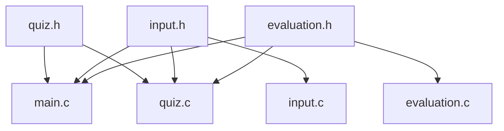

# A program futása

## Felépítés

### Fájlstruktúra

- `main.c`
    - Tartalmazza a `main` függvényt, amely elindítja a programot.
    - Hivatkozik a következő header fájlokra:
        - `quiz.h`
        - `input.h`
        - `evaluation.h`

- `quiz.c`
    - A kvíz logikáját valósítja meg.
    - Hivatkozik a következő header fájlokra:
        - `quiz.h`
        - `input.h`
        - `evaluation.h`

- `input.c`
    - A bemeneti fájlok beolvasását és feldolgozását végzi.
    - Hivatkozik a következő header fájlokra:
        - `input.h`

- `evaluation.c`
    - A felhasználó válaszainak kiértékelését végzi.
    - Hivatkozik a következő header fájlokra:
        - `evaluation.h`

### Header fájlok

- `quiz.h`
    - Deklarálja a kvíz logikájához szükséges függvényeket és adatstruktúrákat.

- `input.h`
    - Deklarálja a bemeneti fájlok beolvasásához szükséges függvényeket és adatstruktúrákat.

- `evaluation.h`
    - Deklarálja a válaszok kiértékeléséhez szükséges függvényeket és adatstruktúrákat.

### Fájlok közötti kapcsolatok

